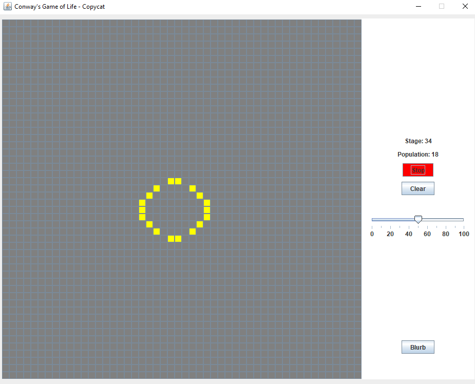

# Conway's Game of Life
John Conway's *Game of Life* written in Java, using Java Swing for the GUI.

## The Game
The *Game of Life* is a cellular automation based on a grid of cells that are either dead or alive. When the game starts, the grid begins going through changes similar to life cycles. These life cycles loosely mimic real-life population growth/decline based on overpopulation and solitude. The initial state of this grid of cells is all the game requires to cycle through these stages of life indefinitely. 

## The Rules

|**Status of Cell in Current Stage**|**Number of Alive Surrounding Cells**|**Status of Cell in Next Stage**|
|---|---|---|
|Alive|2-3|Alive|
|Alive|4+|Dead|
|Alive|< 2|Dead|
|Dead|3|Alive|
|Dead|< 3 or > 3|Dead|

## Preview

## Release
A `.jar` file can be found in `out/`.
Developed using JDK 13.0.1, not tested on other JDK versions.

